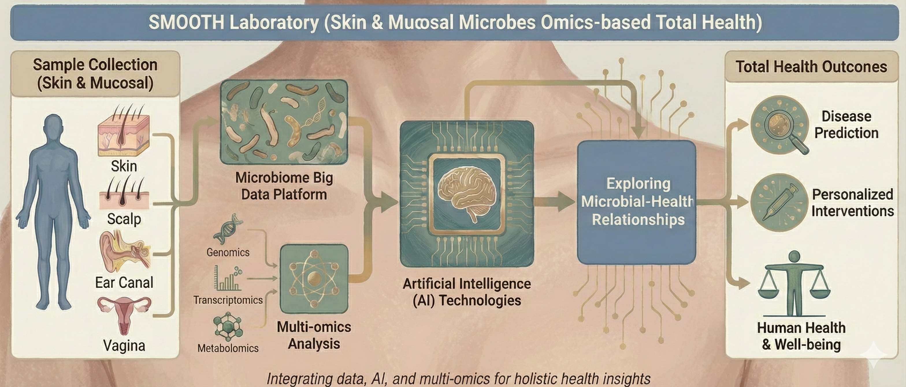

# SMOOTH Laboratory

## About Us

SMOOTH (Skin & Mucosal Microbes Omics-based Total Health) Laboratory is an interdisciplinary research facility affiliated with Southern Medical University. The laboratory is dedicated to integrating skin microbiome big data with artificial intelligence technologies, exploring the relationship between microbial communities and human health through multi-omics analysis approaches.

We have integrated large-scale microbiome data from multiple global centers, including over 2,000 skin microbiome samples and more than 4,000 respiratory microbiome samples, establishing a high-quality microbiome database that provides an important data foundation for in-depth understanding of microbe-host interaction mechanisms.

## Research Focus

### 🧬 Skin Microbiome Studies
- Large-scale data integration and analysis of skin microbiomes
- Research on skin microbial community structure and function
- Discovery of microbial biomarkers related to skin health and diseases

### 🤖 Artificial Intelligence & Bioinformatics
- Development of machine learning-based microbiome data analysis algorithms
- Construction of computational models for microbiome-host interactions
- Intelligent processing pipelines for high-throughput sequencing data

### 🔬 Precision Medicine Applications
- High-precision detection and analysis of intra-tumoral microbiomes
- Contamination control methods for cross-cohort microbiome studies
- Application of microbiome biomarkers in disease diagnosis

### 🌐 Multi-omics Integration Research
- Analysis of 16S rRNA amplicon sequencing data
- In-depth analysis of metagenomic sequencing data
- Systematic integration and interpretation of multi-omics data

---

**Explore Our Projects:** [SMOOTH](https://github.com/SkinMicrobe/SMOOTH) | [ITM Pipeline](https://github.com/SkinMicrobe/ITM)
